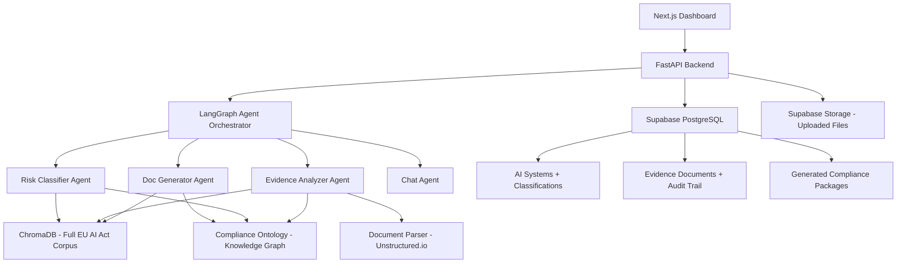

# PRD: ComplyOS v2 — The Real Thing

> **Status:** Draft → Awaiting Approval
> **Author:** Pyae Sone (Seon)
> **Date:** 2026-03-26
> **Last Updated:** 2026-03-26
> **Version:** 2.0 — Leveled up from hackathon demo to defensible product

---

## 0. Honest Self-Assessment

### What v1 (current demo) actually is:

- A thin LLM wrapper over 16 hand-written article summaries
- Claude doing the classification (any lawyer could do it faster)
- Imaginary gap analysis (Claude speculating, not checking real evidence)
- No persistence, no auth, no real users
- A senior dev can copy this in a weekend

### What v2 must become to be worth building:

- A legally-grounded compliance engine with the full EU AI Act corpus
- Structured legal reasoning via knowledge graph, not just text search
- Evidence-based gap analysis that checks REAL documents, not descriptions
- Validated accuracy that compliance officers can trust
- Multi-jurisdiction intelligence that compounds over time

### The moat thesis:

A senior dev can copy a UI. They cannot copy:

1. A maintained, cross-referenced legal knowledge base (1000+ passages)
2. A compliance ontology encoding legal logic as traversable structure
3. A validated benchmark dataset proving classification accuracy
4. Jurisdiction-specific guidance (France/CNIL day 1, expand to 27 EU countries)
5. Evidence collection + audit trail that constitutes legal records
6. Community-contributed compliance templates from real practitioners

---

## 1. Problem Statement

### What problem are we solving?

Every company deploying AI in the EU faces mandatory compliance with the EU AI Act by August 2, 2026. The regulation is 144 pages of dense legal text with 113 articles, 13 annexes, cross-references, exceptions, and country-specific implementations. Non-compliance carries fines up to EUR 35M or 7% of global revenue.

Current solutions:

- **Consultants:** EUR 50K-500K per engagement, months of lead time, doesn't scale
- **DIY:** Read the regulation yourself — most CTOs lack legal expertise
- **Nothing:** Hope for the best — the default choice, and the riskiest

There is NO automated tooling that combines legal accuracy with engineering automation for EU AI Act compliance.

### Who has this problem?

**Primary:** CTOs and VPs of Engineering at companies deploying AI in the EU

- They own the AI systems but don't understand regulatory obligations
- They need actionable compliance steps, not legal opinions

**Secondary:** Data Protection Officers (DPOs) expanding into AI governance

- GDPR was their domain, now AI Act compliance falls on their desk
- They need tooling that maps AI Act requirements to GDPR frameworks they know

**Tertiary:** AI startups (750+ in France, thousands across EU)

- Need to self-certify before going to market
- Can't afford Big 4 consultants

### Why now?

- **Hard deadline:** August 2, 2026 — 129 days away
- **Greenfield:** No dominant compliance tooling exists yet
- **Precedent:** OneTrust reached $5.3B from GDPR compliance. AI Act is broader.
- **Forced purchasing:** Companies MUST comply or face existential fines
- **EU Commission guidance** published Feb 2026 — practical examples now available

---

## 2. What Makes This Uncopiable (Moat Architecture)

### Moat Layer 1: Legal Knowledge Base (Data Moat)

**What:** Full corpus ingestion with semantic chunking and cross-reference preservation

| Source                                    | Status  | Passages         |
| ----------------------------------------- | ------- | ---------------- |
| EU AI Act full text (EUR-Lex)             | v2      | ~500 chunks      |
| Annex I-XIII complete                     | v2      | ~200 chunks      |
| EU Commission guidelines (Feb 2026)       | v2      | ~300 chunks      |
| Code of Practice for GPAI (July 2025)     | v2      | ~150 chunks      |
| CNIL AI guidance (France)                 | v2      | ~100 chunks      |
| Harmonized standards (EN references)      | v3      | ~200 chunks      |
| Enforcement actions & case law            | Ongoing | Grows over time  |
| National implementations (DE, ES, NL, IT) | v3+     | ~100 per country |

**Why it's a moat:** This corpus must be maintained, updated, and cross-referenced as new guidance emerges. The knowledge compounds monthly. Starting late means being permanently behind.

### Moat Layer 2: Compliance Ontology (Structural Moat)

**What:** A knowledge graph encoding the legal logic of the AI Act as traversable structure, not just searchable text.

```
AISystem
  -> classifiedAs: RiskLevel
  -> triggeredBy: [Article 6, Annex III]
  -> requiredCompliance: [
       Article 9 (Risk Management)
         -> subRequirements: [identify, evaluate, adopt measures, test]
         -> exceptions: [SME provisions, sandbox participants]
         -> crossReferences: [Article 72 post-market monitoring]
         -> evidence_needed: [risk_assessment_doc, test_results, monitoring_plan]
       Article 10 (Data Governance)
         -> subRequirements: [collection, preparation, bias examination]
         -> evidence_needed: [data_sheet, bias_audit, training_data_inventory]
       ...
     ]
```

**Why it's a moat:** This requires legal expertise to build correctly. LLM text search can find relevant passages, but it can't reason about which exception applies to which sub-requirement in which jurisdiction. The ontology enables structured, auditable reasoning — not probabilistic guessing.

### Moat Layer 3: Evidence-Based Assessment (Product Moat)

**What:** Instead of "Claude imagines gaps," users upload REAL compliance artifacts and we check them against requirements.

Evidence types:

- Risk assessment documents (PDF/DOCX upload -> parse -> check against Article 9)
- Model cards / data sheets (parse -> check against Article 10, 11)
- System architecture docs (parse -> check against Article 12, 15)
- Human oversight procedures (parse -> check against Article 14)
- Testing and validation reports (parse -> check against Article 15)

**Why it's a moat:** The document parsing, extraction, and compliance-checking logic is domain-specific and hard to replicate. Each document type needs custom extraction rules. The more documents we process, the better our parsing becomes.

### Moat Layer 4: Validated Benchmark (Trust Moat)

**What:** A curated dataset of 100+ AI system descriptions with expert-validated correct classifications and compliance assessments.

Process:

1. Create 100+ diverse AI system descriptions across all 8 Annex III categories
2. Have 2-3 EU AI Act experts independently classify each one
3. Measure ComplyOS accuracy against expert consensus
4. Publish results transparently (target: 95%+ agreement with experts)

**Why it's a moat:** Trust in compliance tooling requires proof. "Our AI says it's compliant" isn't enough — "Our AI agrees with expert lawyers 95% of the time, here's the data" IS enough. This benchmark becomes our credential. Nobody else has this.

### Moat Layer 5: Multi-Jurisdiction Intelligence (Geographic Moat)

**What:** France-first, then expand. Each country has different:

- National competent authority (France: CNIL + future AI Office)
- Regulatory sandbox rules and timelines
- Industry-specific guidance
- Language of compliance documentation

**Why it's a moat:** A US company will build one generic EU tool. We build France-specific, then Germany-specific, then Spain-specific. Each jurisdiction added is months of work. First-mover in each country wins that market.

### Moat Layer 6: Audit Trail as Legal Record (Switching Moat)

**What:** Every classification decision, every gap identified, every document uploaded is timestamped and logged as a compliance audit trail.

**Why it's a moat:** Once a company uses ComplyOS and builds their compliance history on our platform, switching to a competitor means losing their audit trail. Regulators may ask for historical compliance records — which only exist in ComplyOS.

---

## 3. Success Criteria

### Primary Metric

A CTO can go from "I have no idea if we're compliant" to a complete, evidence-based compliance assessment with generated documentation in under 30 minutes.

### Secondary Metrics

- [ ] Classification accuracy > 95% against expert benchmark (100+ test cases)
- [ ] Full EU AI Act corpus ingested (1000+ semantically chunked passages)
- [ ] Compliance ontology covers all 8 Annex III categories with sub-requirements
- [ ] Evidence upload supports PDF, DOCX, and Markdown parsing
- [ ] Gap analysis produces evidence-based findings (not speculative)
- [ ] Audit trail logs every decision with timestamp and reasoning
- [ ] CNIL/France-specific guidance integrated
- [ ] 80%+ test coverage on classification and assessment logic

---

## 4. User Stories

### Story 1: AI System Registration + Classification (v1 — DONE)

**As a** CTO, **I want to** describe my AI systems and get them automatically classified by risk level, **so that** I know which ones need compliance work.

**Already built. Accuracy improvement needed via full corpus RAG.**

### Story 2: Evidence-Based Gap Analysis (v2 — NEW)

**As a** DPO, **I want to** upload my existing compliance documents and get them checked against EU AI Act requirements, **so that** I know exactly what's missing with proof, not speculation.

**Acceptance Criteria:**

- [ ] Given a PDF risk assessment upload, when analyzed, then extract key sections and check against Article 9 sub-requirements
- [ ] Given a model card upload, then check against Article 10 (data governance) and Article 11 (technical documentation) requirements
- [ ] Given gaps identified, then cite the SPECIFIC section of the uploaded document that's insufficient AND the SPECIFIC article requirement it fails
- [ ] Given no documents uploaded for a requirement, then flag as "no evidence provided" (not "non-compliant")

### Story 3: Compliance Documentation Generation (v2 — ENHANCED)

**As a** compliance officer, **I want to** generate pre-filled compliance documentation that incorporates my existing artifacts, **so that** I have ready-to-file documents, not empty templates.

**Acceptance Criteria:**

- [ ] Given uploaded evidence + gap analysis results, when generating docs, then pre-fill with information extracted from uploaded documents
- [ ] Given generated documentation, then include placeholders ONLY for genuinely missing information
- [ ] Given generated docs, then export as Markdown, DOCX, and PDF
- [ ] Generated docs include proper Article 11 / Annex IV structure with all required sections

### Story 4: Compliance Ontology Navigation (v2 — NEW)

**As a** CTO, **I want to** explore the EU AI Act requirements interactively, **so that** I understand exactly what applies to my systems without reading 144 pages.

**Acceptance Criteria:**

- [ ] Given a classified system, then show a visual requirement tree (which articles apply, their sub-requirements, exceptions)
- [ ] Given a requirement node, then show the original legal text, plain-English explanation, and links to guidance
- [ ] Given a requirement, then show compliance status (compliant / partial / non-compliant / not assessed) based on uploaded evidence

### Story 5: Audit Trail + Compliance History (v2 — NEW)

**As a** DPO, **I want to** have a complete log of all compliance decisions and changes, **so that** I can demonstrate due diligence to regulators.

**Acceptance Criteria:**

- [ ] Every classification, assessment, and document generation is logged with timestamp, reasoning, and user
- [ ] Audit log is exportable as PDF for regulatory submissions
- [ ] Changes to system descriptions or re-classifications show diff with previous version

---

## 5. Technical Architecture v2

### Stack

| Layer           | Choice                             | Why                                          |
| --------------- | ---------------------------------- | -------------------------------------------- |
| Frontend        | Next.js 16 + TypeScript + Tailwind | Already built, RSC for performance           |
| Backend         | FastAPI (Python)                   | LangChain ecosystem, async, Pydantic         |
| Database        | Supabase (PostgreSQL + Auth + RLS) | Persistence, auth, row-level security        |
| Vector Store    | ChromaDB -> Pinecone (production)  | Managed vector DB for production reliability |
| Knowledge Graph | Neo4j or NetworkX (start simple)   | Compliance ontology traversal                |
| LLM             | Claude API (primary)               | Best legal reasoning                         |
| Document Parse  | Unstructured.io or LlamaParse      | PDF/DOCX extraction                          |
| File Storage    | Supabase Storage                   | Evidence document uploads                    |
| Hosting         | Vercel + Railway                   | Fast deploy, scale later                     |

### Architecture v2



### Key Architectural Differences from v1

| v1 (Current)              | v2 (Leveled Up)                       |
| ------------------------- | ------------------------------------- |
| 16 hand-written summaries | 1000+ passages from full legal corpus |
| Text similarity search    | Ontology-guided structured reasoning  |
| Speculative gap analysis  | Evidence-based document checking      |
| In-memory storage         | Supabase with audit trail             |
| No auth                   | Supabase Auth with RLS                |
| No file handling          | PDF/DOCX upload + parsing             |
| English only              | French/CNIL guidance integrated       |

---

## 6. Build Roadmap

### Phase 1: Foundation Fix (Week 1) — CURRENT PRIORITY

- [ ] Ingest full EU AI Act from EUR-Lex (proper semantic chunking)
- [ ] Ingest EU Commission practical guidelines (Feb 2026)
- [ ] Ingest CNIL AI guidance
- [ ] Migrate from in-memory to Supabase (persistence + auth)
- [ ] Create evaluation dataset (50 AI system descriptions with expected classifications)
- [ ] Measure and log classification accuracy
- **Gate:** RAG answers are legally accurate, classification accuracy > 85%

### Phase 2: Compliance Ontology (Week 2)

- [ ] Build ontology data structure (articles -> sub-requirements -> exceptions -> cross-references)
- [ ] Populate ontology for all Annex III categories
- [ ] Integrate ontology with classification agent (structured traversal, not just text search)
- [ ] Build requirement tree visualization in UI
- **Gate:** Classification uses structured reasoning, accuracy > 90%

### Phase 3: Evidence-Based Assessment (Week 3)

- [ ] Implement document upload (PDF, DOCX, MD)
- [ ] Integrate document parser (Unstructured.io / LlamaParse)
- [ ] Build Evidence Analyzer agent (compare extracted content vs requirements)
- [ ] Update gap analysis UI to show evidence-based findings
- [ ] Implement audit trail logging
- **Gate:** Gap analysis cites specific document sections vs specific requirements

### Phase 4: Polish + Validate (Week 4)

- [ ] Expand evaluation dataset to 100+ test cases
- [ ] Get 2-3 expert reviews on classification accuracy (legal contacts, LinkedIn outreach)
- [ ] Generate proper DOCX/PDF exports (not just Markdown)
- [ ] Landing page with product positioning
- [ ] Demo mode with pre-loaded realistic scenarios
- [ ] Deploy to production (Vercel + Railway)
- **Gate:** 95%+ accuracy on benchmark, production-deployed, demo-ready

### Phase 5: Growth Features (Post-VivaTech)

- [ ] Multi-jurisdiction: Germany (BfDI), Spain, Netherlands
- [ ] Team collaboration (multiple users per organization)
- [ ] API for programmatic compliance checks (CI/CD integration)
- [ ] Continuous monitoring (re-assess when regulations update)
- [ ] Compliance certificate generation
- [ ] Integration with MLflow, W&B, Hugging Face model cards

---

## 7. Competitive Positioning

### Why not just use OneTrust / Vanta / Drata?

| Feature                     | OneTrust/Vanta/Drata           | ComplyOS                              |
| --------------------------- | ------------------------------ | ------------------------------------- |
| AI Act specific             | Checkbox in a broader GRC tool | Purpose-built for AI Act              |
| Classification intelligence | Manual questionnaire           | AI agent with RAG + ontology          |
| Evidence analysis           | Upload + manual review         | AI-powered document parsing           |
| Legal accuracy              | Depends on their legal team    | Validated benchmark + full corpus     |
| European jurisdiction       | Generic EU                     | France-first, then country-by-country |
| Time to value               | Weeks of configuration         | 30 minutes to first assessment        |
| Price                       | $10K-100K/year enterprise      | $500-5000/month SaaS                  |

### Why not just hire a consultant?

| Feature            | Big 4 Consultant              | ComplyOS                           |
| ------------------ | ----------------------------- | ---------------------------------- |
| Cost               | EUR 50K-500K per engagement   | EUR 500-5000/month                 |
| Timeline           | 3-6 months                    | 30 minutes to first assessment     |
| Scalability        | 1 engagement at a time        | Unlimited systems                  |
| Ongoing monitoring | Separate engagement           | Continuous                         |
| Audit trail        | PDF report you file somewhere | Persistent, searchable, exportable |

---

## 8. Out of Scope (v2)

- NOT building: Multi-tenant admin (single org for now)
- NOT building: Automated system discovery (user registers manually)
- NOT building: Integration with GRC platforms (standalone first)
- NOT building: Real-time code scanning (document-based assessment)
- NOT building: Multilingual UI (English first, French docs/guidance in corpus)
- Will revisit in v3: API for CI/CD integration
- Will revisit in v3: Team collaboration features
- Will revisit in v3: Compliance certificate generation

---

## 9. Open Questions

- [ ] Can we get the full EU AI Act text programmatically from EUR-Lex API, or do we need to scrape?
- [ ] What's the best chunking strategy for legal text (by article? by paragraph? by logical unit?)
- [ ] Should we use Neo4j for the ontology or start with a simpler graph structure in PostgreSQL?
- [ ] How do we validate classification accuracy without access to paid legal experts? (LinkedIn outreach? Law school partnerships?)
- [ ] Is Unstructured.io the best choice for document parsing, or should we use LlamaParse / Docling?

---

## 10. Approval

- [ ] **PRD reviewed and understood** — I (Seon) confirm the requirements are clear
- [ ] **Architecture approved** — The technical approach makes sense
- [ ] **Scope locked** — No features will be added during build without updating this PRD
- [ ] **Moat thesis validated** — The 6 moat layers make sense as a defensibility strategy

> **This PRD represents the transition from "hackathon demo" to "real product." The demo got us started. The moat layers will make us uncopiable.**
