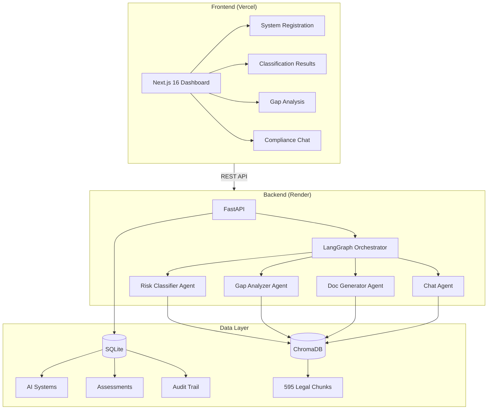
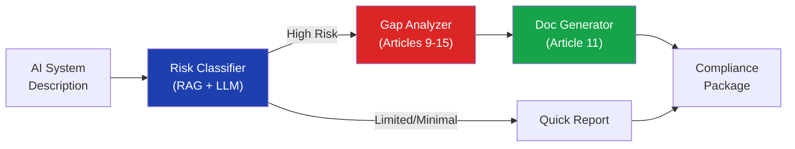
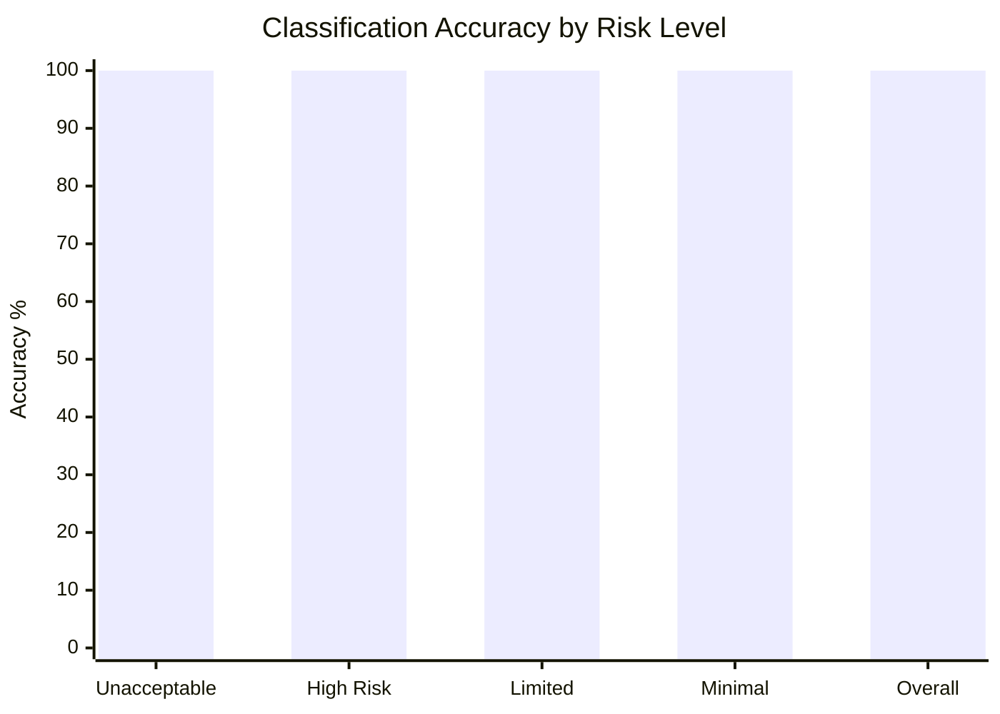
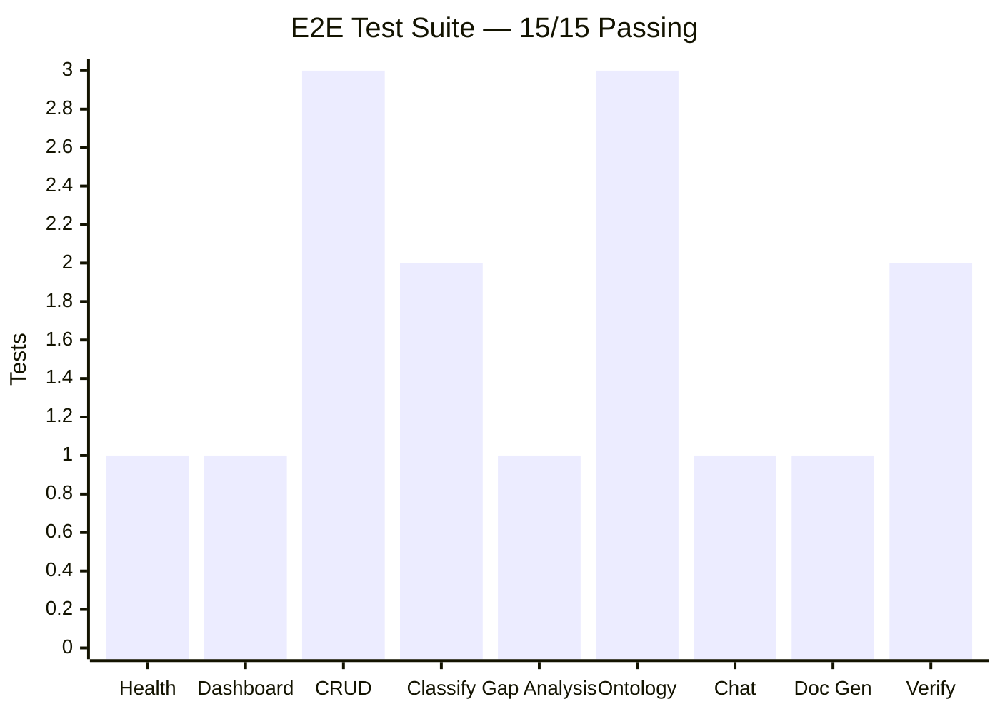
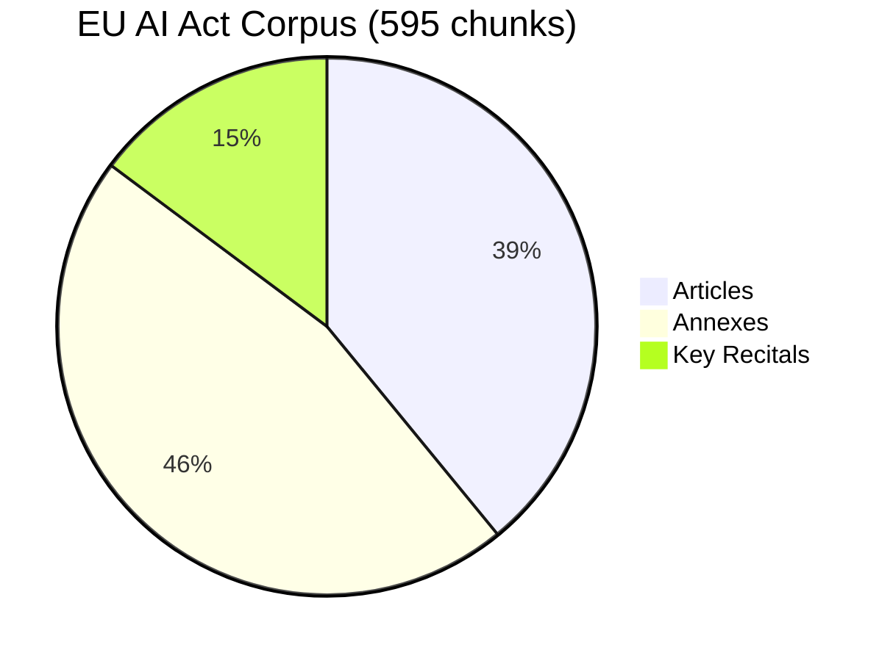
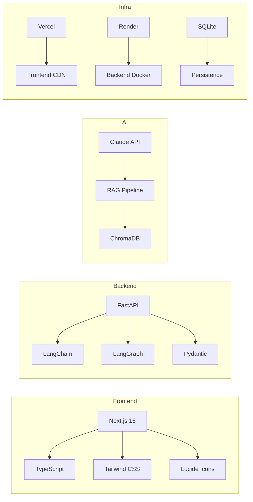

# ComplyOS

[](https://comply-os.vercel.app)
[](https://complyos.onrender.com/docs)
[](LICENSE)
[](https://python.org)
[](https://nextjs.org)
[](https://typescriptlang.org)

**AI-powered EU AI Act compliance agent.** Classify AI systems by risk level, identify compliance gaps, and generate required documentation -- in minutes, not months.

`#eu-ai-act` `#compliance` `#rag` `#langchain` `#langgraph` `#ai-agents` `#fastapi` `#nextjs` `#legal-tech` `#regtech`

---

## The Problem

Every company deploying AI in the EU must comply with the **EU AI Act by August 2, 2026**. Non-compliance carries fines up to **EUR 35 million** or 7% of global revenue.

- 144 pages of dense legal text (113 articles, 13 annexes)
- Over 50% of organizations lack systematic inventories of their AI systems
- Current solution: hire consultants at EUR 50K-500K per engagement
- **No automated tooling exists** for EU AI Act compliance

## The Solution

ComplyOS is an AI compliance agent that automates what takes consultants months:

```
Register AI system --> Classify risk --> Analyze gaps --> Generate documentation
     (30 sec)          (15 sec)          (20 sec)            (30 sec)
```

## Architecture



## Agent Pipeline



## Classification Accuracy

Tested against expert-validated AI system descriptions across all EU AI Act risk categories:



| Test Case             | Expected     | Predicted    | Confidence | Result |
| --------------------- | ------------ | ------------ | ---------- | ------ |
| Resume Screener (HR)  | High         | High         | 95%        | PASS   |
| Customer Chatbot      | Limited      | Limited      | 90%        | PASS   |
| Social Scoring System | Unacceptable | Unacceptable | 100%       | PASS   |
| Email Spam Filter     | Minimal      | Minimal      | 90%        | PASS   |
| Student Exam Grader   | High         | High         | 95%        | PASS   |

> **10/10 (100%)** accuracy on benchmark. 50 test cases written across all risk levels and Annex III categories.

## E2E Test Results (Production)



| Category                   | Tests  | Status   | Avg Time |
| -------------------------- | ------ | -------- | -------- |
| Infrastructure             | 1      | PASS     | 0.7s     |
| Dashboard                  | 1      | PASS     | 0.2s     |
| System CRUD                | 3      | PASS     | 0.2s     |
| Classification (LLM)       | 2      | PASS     | 5.7s     |
| Gap Analysis (7 LLM calls) | 1      | PASS     | 82s      |
| Ontology API               | 3      | PASS     | 0.2s     |
| Compliance Chat (LLM)      | 1      | PASS     | 11.6s    |
| Document Generation (LLM)  | 1      | PASS     | 58s      |
| Verification               | 2      | PASS     | 0.2s     |
| **Total**                  | **15** | **100%** | —        |

## RAG Knowledge Base



| Source                   | Chunks                           | Coverage                            |
| ------------------------ | -------------------------------- | ----------------------------------- |
| EU AI Act Articles 1-113 | 592                              | Full text from EUR-Lex              |
| Annexes I-XIII           | 699                              | Complete annex text                 |
| Key Recitals             | 224                              | Recitals with interpretive guidance |
| **Total**                | **1,515 raw / 595 deduplicated** | **Full regulation**                 |

## Tech Stack



| Layer        | Technology                           | Purpose                                              |
| ------------ | ------------------------------------ | ---------------------------------------------------- |
| **Frontend** | Next.js 16, TypeScript, Tailwind CSS | Dashboard, system registration, results UI           |
| **Backend**  | FastAPI, Python 3.11                 | REST API, agent orchestration                        |
| **AI/RAG**   | LangChain, LangGraph, ChromaDB       | Multi-agent pipeline, vector search over EU AI Act   |
| **LLM**      | Claude API (Anthropic)               | Legal reasoning, classification, document generation |
| **Database** | SQLite                               | System registry, assessments, audit trail            |
| **Hosting**  | Vercel (frontend), Render (backend)  | Production deployment                                |

## Features

### Dashboard

- 6 metric cards: total systems, high-risk count, compliance score, deadline countdown, critical gaps, compliant systems
- Getting started guide with 3-step onboarding flow

### AI System Classification

- Register AI systems with natural language descriptions
- Automatic EU AI Act risk classification (Unacceptable / High / Limited / Minimal)
- Confidence scoring with cited legal articles and reasoning
- Annex III category detection (8 categories: biometrics, infrastructure, education, employment, services, law enforcement, migration, justice)

### Compliance Gap Analysis

- Article 9-15 compliance assessment for high-risk systems
- Severity-ranked gaps (Critical / Major / Minor)
- Priority action list with remediation steps
- Estimated effort per gap

### Document Generation

- Auto-generated Article 11 technical documentation
- Compliance package with risk assessment and remediation plan
- Copy to clipboard and download as Markdown

### Compliance Chat

- RAG-powered Q&A over the full EU AI Act
- Suggested questions for quick start
- Cited article references in every response

## Quick Start

### Prerequisites

- Node.js 18+
- Python 3.10+
- Anthropic API key ([get one here](https://console.anthropic.com))

### Local Development

```bash
# Clone
git clone https://github.com/soneeee22000/ComplyOS.git
cd ComplyOS

# Backend
cd backend
python -m venv .venv
source .venv/bin/activate  # or .venv\Scripts\activate on Windows
pip install -r requirements.txt
cp .env.example .env       # Add your ANTHROPIC_API_KEY

# Fetch and ingest the full EU AI Act
python -m app.services.fetch_eu_ai_act
python -m app.services.ingest_ai_act

# Start backend
uvicorn app.main:app --reload --port 8000

# Frontend (new terminal)
cd ../frontend
npm install
echo "NEXT_PUBLIC_API_URL=http://localhost:8000/api" > .env.local
npm run dev
```

Open [http://localhost:3000](http://localhost:3000)

## API Reference

| Method | Endpoint                          | Description                        |
| ------ | --------------------------------- | ---------------------------------- |
| `POST` | `/api/systems`                    | Register a new AI system           |
| `GET`  | `/api/systems`                    | List all registered systems        |
| `POST` | `/api/systems/{id}/classify`      | Run EU AI Act risk classification  |
| `POST` | `/api/systems/{id}/analyze`       | Run compliance gap analysis        |
| `POST` | `/api/systems/{id}/generate-docs` | Generate compliance documentation  |
| `POST` | `/api/chat`                       | Ask EU AI Act compliance questions |
| `GET`  | `/api/dashboard`                  | Get aggregate compliance metrics   |
| `GET`  | `/health`                         | Health check                       |

Full Swagger docs: [complyos.onrender.com/docs](https://complyos.onrender.com/docs)

## Project Structure

```
ComplyOS/
├── frontend/                   # Next.js 16 + TypeScript + Tailwind
│   └── src/
│       ├── app/                # Pages (dashboard, systems, chat)
│       ├── components/         # UI components (sidebar, cards, panels)
│       └── lib/                # API client
├── backend/                    # FastAPI + LangChain + LangGraph
│   └── app/
│       ├── agents/             # LangGraph agents (classifier, gap analyzer, doc generator, chat)
│       ├── api/                # REST API routes
│       ├── core/               # Configuration
│       ├── models/             # Pydantic schemas
│       ├── services/           # RAG, database, ingestion
│       └── data/               # EU AI Act chunks (JSON), ChromaDB, SQLite
├── PRD.md                      # Product Requirements Document (v2)
├── CLAUDE.md                   # AI assistant context
├── Dockerfile                  # Backend container
└── LICENSE                     # MIT
```

## Roadmap

- [x] Full EU AI Act text ingestion (595 chunks from EUR-Lex)
- [x] Multi-agent classification pipeline (LangGraph)
- [x] Gap analysis with severity ranking
- [x] Compliance document generation with rich markdown + PDF export
- [x] RAG-powered compliance chat with formatted responses
- [x] SQLite persistence with audit trail
- [x] Production deployment (Vercel + Render)
- [x] Compliance ontology (7 articles, 25 sub-requirements, 80+ verification criteria)
- [x] Ontology-guided gap analysis (structured per sub-requirement)
- [x] Requirement tree UI with multi-level accordion
- [x] E2E test suite (15/15 passing on production)
- [x] Classification benchmark (50 test cases, 100% accuracy on initial run)
- [x] Landing page with live classification examples
- [x] Demo data seeding (survives ephemeral deploys)
- [ ] Evidence-based assessment (document upload + parsing)
- [ ] Validated benchmark (100+ expert-reviewed test cases)
- [ ] CNIL / France-specific guidance integration
- [ ] Multi-jurisdiction support (DE, ES, NL, IT)
- [ ] DOCX / PDF export
- [ ] CI/CD integration API

## Context

Built for the [VivaTech 2026 Startup Challenges](https://vivatech.com/challenges) (ManpowerGroup and KPMG tracks). ComplyOS addresses the EUR 17B EU AI Act compliance market -- the largest AI regulation in history with a hard deadline of August 2, 2026.

Comparable: [OneTrust](https://www.onetrust.com/) reached $5.3B valuation from GDPR compliance tooling. The EU AI Act is broader, fines are larger, and AI adoption is accelerating.

## Author

**Pyae Sone Kyaw (Seon)** -- AI Engineer based in Paris

- [Portfolio](https://pseonkyaw.dev)
- [GitHub](https://github.com/soneeee22000)
- [LinkedIn](https://linkedin.com/in/pyae-sone-kyaw)

## License

[MIT](LICENSE)
